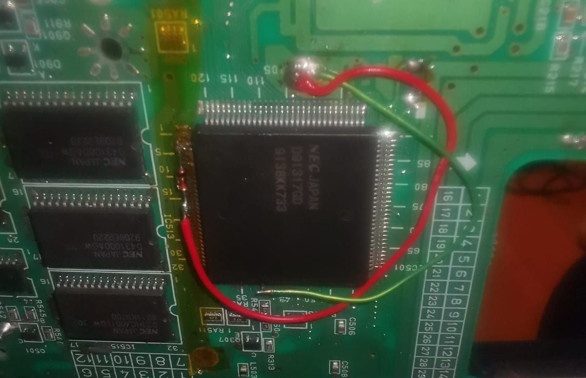

# Duo Voodoo Disabler

A one-component permanent disabler for the original PC Engine / Turbo Duo CD systems.
The idea is to turn off the CD part of the machine so it's compatible with Turbo Everdrive Pro CD emulation and stereo sound.
Restores clean auto-boot and full HuCard compatibility with a single 1N4148 signal diode.

## What it fixes

Lifting pins 3 and 40 of the D91317GD clears the bus for TED PRO CD emulation, but leaves these issues:
- TED 2.5 / TED Pro requiring manual reset button on every power-up
- HuCards refusing to boot on the modded Duo
- Boot state machine hang caused by lifted D91317GD pins floating into the shared bus
- Still no stereo sound, because pin 1 is still being used for the A20 line during the boot sequence

## Applicability

This fix is scoped narrowly. Confirm **all** of the following before installing:

- PC Engine Duo with a **permanently dead CD drive** (CD functionality is not being recovered)
- Hucards , TED 2.5 or TED Pro/Core as the intended playback path

This fix is **NOT** applicable to:
- Duos with working CD drives — use ZAXOUR's **Duo Disguiser** instead (reversible masking between CD and TED modes)
- Installs where ASIC pins 3 and 40 are not lifted
- PC Engine / CoreGrafx / TurboGrafx-16 (no D91317GD present)

## Installation

-Lift pins 3 and 40 of the D91317GD 
-Install a single **1N4148** signal diode:
- **Cathode** → NEC D91317GD ASIC pin 3
- **Anode** → GND
- Pin 40 → GND
- Remove R616
- Solder a wire from pin 1 of the HuCard slot to the pad of R616 that connects to R613

*Reference photo for the ASIC disabling side.*

## Verification status

| Test | Result |
|------|--------|
| Auto-boot TED across 5+ power cycles | ✅ Confirmed |
| HuCard boot | ✅ Confirmed |
| TED Pro CD emulation compatibility | ⏳ Pending bench verification |
| Soft-reset path (TED menu reset without XRESET) | ⏳ Pending bench verification |
| Oscilloscope verification of pin 3 behavior while TED PRO emulates CD | ⏳ Pending |
| Multi-unit replication | ⏳ n=1 currently |
| Verify TED pro EDFX sound settings | ⏳ Pending bench verification |

Open an issue if you replicate on a second unit or verify one of the pending items.

## Credits

Based on the work of the PC Engine modding community. Special thanks to everyone whose prior research on the D91317GD and the DUO architecture made this fix possible.

## License

MIT — see [LICENSE](LICENSE).
